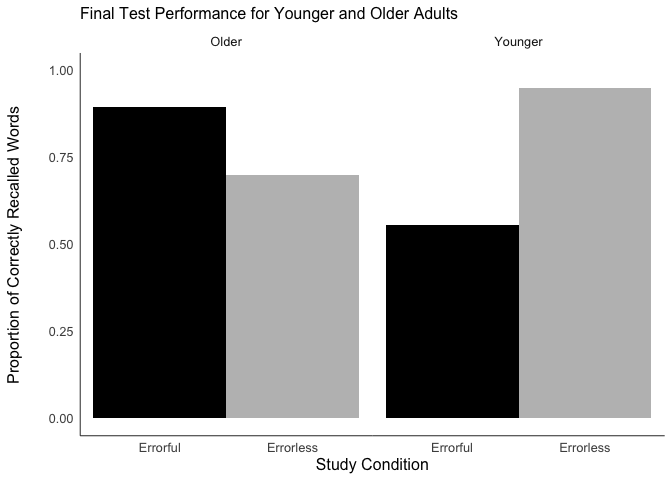

Graphics
================
Morgan Shumaker

``` r
library(pacman) 
p_load(tidyverse, dplyr, devtools, ggplot2, gplots, skimr, markdown, rmarkdown, broom, ggridges, readxl, BSDA, scales, ggthemes, readr, plotrix)
```

## Importing Data

``` r
Exp1_Graphics <- read_csv("Exp1.csv")
```

    ## Rows: 118 Columns: 32
    ## ── Column specification ────────────────────────────────────────────────────────
    ## Delimiter: ","
    ## chr  (4): AgeGroup, AgeGroup2, Other Description, Metacognition
    ## dbl (22): Random ID, GuessAcc, GuessRT, Prop_Repeated_Errors, ErrorfulAcc_Ex...
    ## lgl  (6): Repetition, Imagery, Action, Keyword, Story, Other
    ## 
    ## ℹ Use `spec()` to retrieve the full column specification for this data.
    ## ℹ Specify the column types or set `show_col_types = FALSE` to quiet this message.

## Figure 1

``` r
Exp1_Graphics <- Exp1_Graphics %>% 
  mutate(condition = case_when(Condition == 0 ~ "Errorless",
                               Condition == 1 ~ "Errorful",
                               TRUE ~ as.character(Condition))) %>% 
  mutate(accuracy = as.numeric(Accuracy))
  
ggplot(Exp1_Graphics, aes(y=accuracy, x=condition, fill = condition)) + 
    geom_bar(stat= "identity", width = 1)+ facet_wrap(~AgeGroup2)+ylim(0,1)+ theme_minimal()+
  scale_fill_manual(values=c("black", "grey"))+ 
  labs(x = "Study Condition", y = "Proportion of Correctly Recalled Words", title = "Final Test Performance for Younger and Older Adults")+
  theme(axis.line = element_line(colour = "black", size = .3))+
  theme(legend.position="none")+ theme(panel.grid.major = element_blank())+
  theme(panel.grid.minor = element_blank())+
  theme(text = element_text(size = 12, family = "Arial", color = "black"))+
  theme(axis.title.y = element_text(margin = margin(t = 0, r = 20, b = 0, l = 0)))+
  theme(panel.spacing.x = unit(0, "null"))+
  theme(plot.title = element_text(size=12))
```

<!-- -->

*Formatting in APA*  
*Note: Rmd doesn’t work with function theme_apa(). Must comment when
knitting*

``` r
#ggplot(Exp1_Graphics, aes(y=accuracy, x=condition, fill = condition)) + 
    #geom_bar(stat= "identity", width = 1)+ facet_wrap(~AgeGroup2)+ylim(0,1)+theme_apa(base_size = 12, base_family = "Arial")+
 # scale_fill_manual(values=c("black", "grey"))+labs(x = "Study Condition", y = "Proportion of Correctly Recalled Words", title = "Final Test Performance for Younger and Older Adults")+theme(legend.position="none")
```
