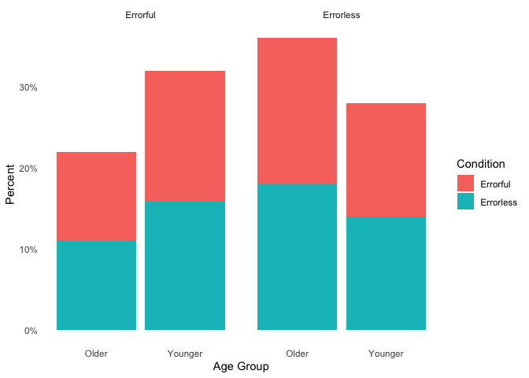

SEED Experiment 1
================
Morgan Shumaker

``` r
library(pacman) 
p_load(tidyverse, dplyr, devtools, ggplot2, gplots, skimr, markdown, rmarkdown, broom, ggridges, readxl, BSDA, scales)
```

## Importing Data

``` r
SEED_Exp1 <- read_xlsx("R_Exp1_SEED.xlsx")
```

``` r
SEED_Exp1_wide <- read_xlsx("R_Exp1SEED_wide.xlsx")
```

## Errorless

To run a z-test with this package (BSDA), the data needs to be in a data
frame so that R recognizes it as an object:

``` r
SEED_Exp1_wide <- data.frame(SEED_Exp1_wide)
```

*Create data frames*

``` r
  Older_Errorless <- data.frame(SEED_Exp1_wide$Older_Errorless)
```

``` r
  Younger_Errorless <- data.frame(SEED_Exp1_wide$Younger_Errorless)
```

*Z test*

``` r
  z.test(x = Older_Errorless, y = Younger_Errorless, alternative = "two.sided", mu = 0, sigma.x = 15, sigma.y = 15)
```

    ## 
    ##  Two-sample z-Test
    ## 
    ## data:  Older_Errorless and Younger_Errorless
    ## z = -0.0053851, p-value = 0.9957
    ## alternative hypothesis: true difference in means is not equal to 0
    ## 95 percent confidence interval:
    ##  -7.677102  7.635032
    ## sample estimates:
    ##  mean of x  mean of y 
    ## -0.6310349 -0.6099996

## Errorful

*Create data frames*

``` r
  Older_Errorful <- data.frame(SEED_Exp1_wide$Older_Errorful)
```

``` r
  Younger_Errorful <- data.frame(SEED_Exp1_wide$Younger_Erroful)
```

*Z test*

``` r
  z.test(x = Older_Errorful, y = Younger_Errorful, alternative = "two.sided", mu = 0, sigma.x = 15, sigma.y = 15)
```

    ## 
    ##  Two-sample z-Test
    ## 
    ## data:  Older_Errorful and Younger_Errorful
    ## z = -2.273e-07, p-value = 1
    ## alternative hypothesis: true difference in means is not equal to 0
    ## 95 percent confidence interval:
    ##  -7.656068  7.656066
    ## sample estimates:
    ##     mean of x     mean of y 
    ## -4.625933e-07  4.252953e-07

## Graphics

``` r
SEED_Plots <- read_xlsx("SEED_Exp1_RPlots.xlsx")
```

``` r
SEED_Plots <- SEED_Plots %>%
  mutate(Metacog = case_when(Metacognition == "0" ~ "Errorless",
                             Metacognition == "1" ~ "Errorful",
                             TRUE ~ as.character(Metacognition)))
```

``` r
ggplot(SEED_Plots, aes(x = Age_Group, fill = Condition)) + geom_bar(position = "stack") +  facet_wrap(~Metacog) +
  scale_y_continuous(labels = scales::percent_format(scale = 1)) +
  labs(x = "Age Group", y = "Percent") + 
  theme_minimal()
```

<!-- -->
